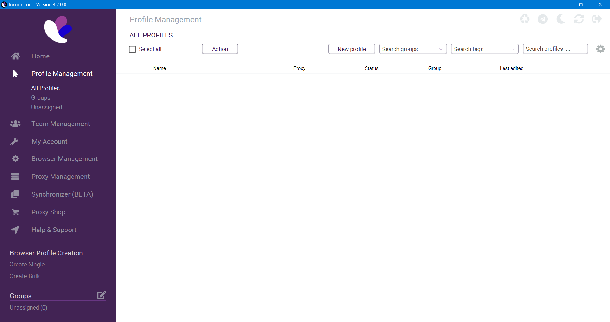
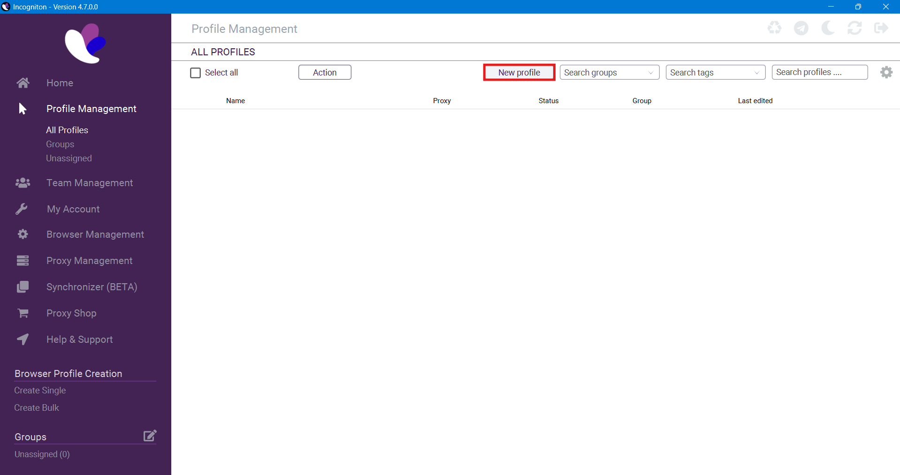
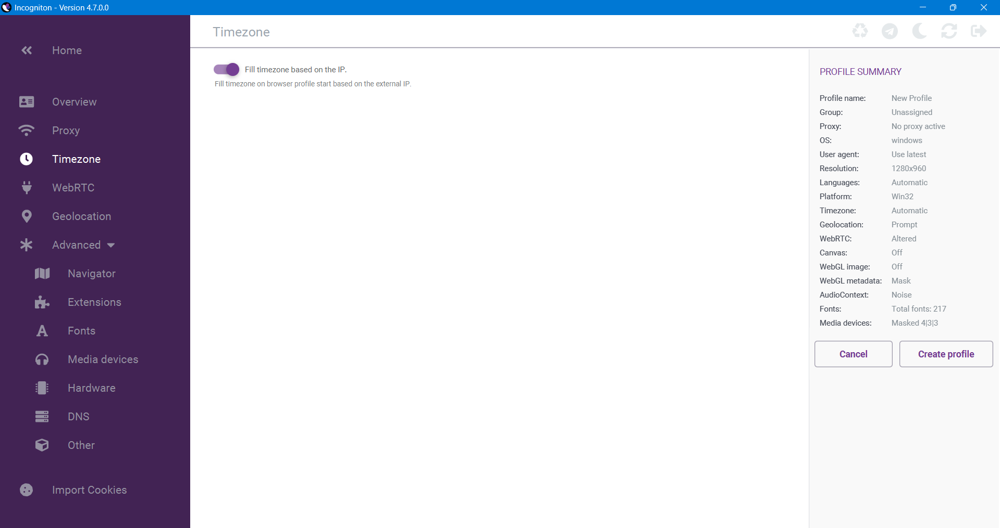

# Profile Setup

## Overview

Incogniton’s anti-detect browser lets you create customized profiles to manage your online identities securely and efficiently. This guide provides step-by-step instructions to help you set up a new profile that’s optimized for your specific needs. Make sure you’re logged in and have navigated to the "Profiles" tab from the main menu.

## Before Creating Your Profile

Before diving in, ensure you have a clear idea of the profile’s purpose. Whether it's for managing multiple social media accounts, testing web applications, or any other activity, having a descriptive profile name and understanding the necessary settings will help you stay organized.

### Step 1: Log in and Navigate to Profiles

- Open Incognition browser.
- Click on the Profiles tab from the main menu.

### Step 2: Create a New Profile

- Click the "Create New Profile" button.
- Enter a clear, descriptive name for your profile.

### Step 3: Basic Configuration

- Timezone: Set this to match your IP by making sure the switch is switched on

### Step 4: Advanced Configuration

- User Agent: Select or manually enter a user agent that matches your needs (desktop, mobile, or custom).
- Cookies Management: Choose how cookies are handled (cleared on exit or persistent).
- WebRTC: Configure this to disable or mask your real IP address.
- Fingerprinting Protection: Enable fingerprinting protections to prevent unique identification.

### Step 5: Proxy Settings

- Select your proxy type (HTTP, SOCKS5).
- Enter your proxy IP address, port, username, and password if required.
- Click Test Proxy to ensure your settings are correct.

### Step 6: Save and Launch

- After verifying your settings, click "Save".
- Launch the profile to confirm everything is working as expected.
