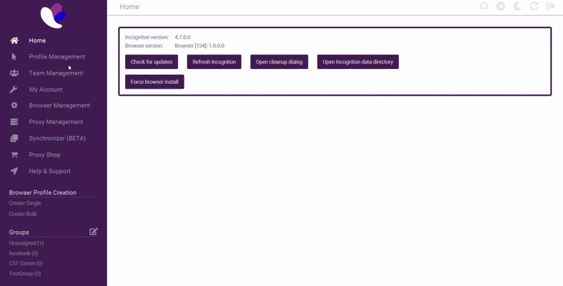
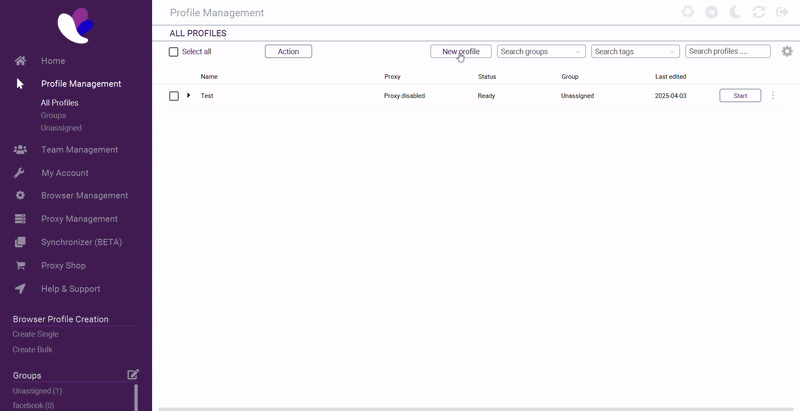
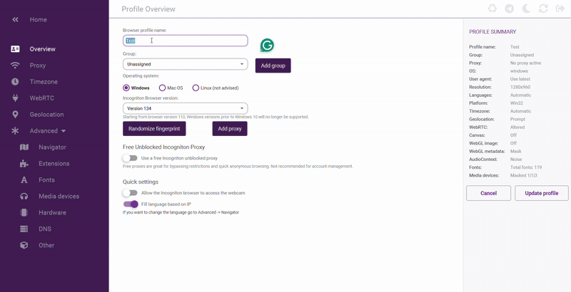
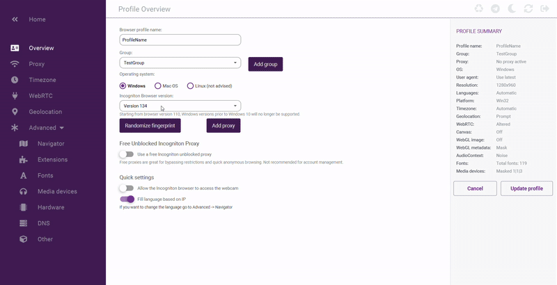
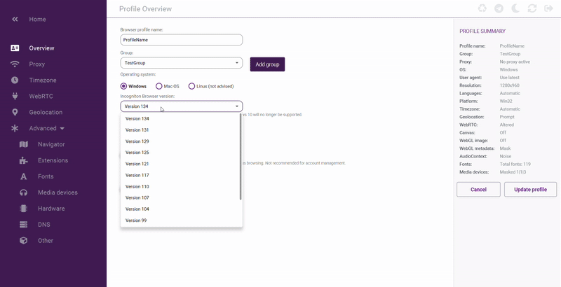
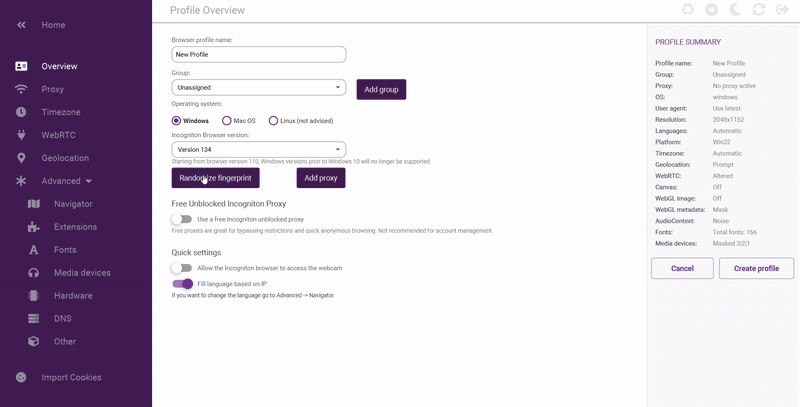
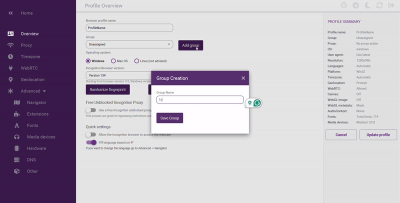
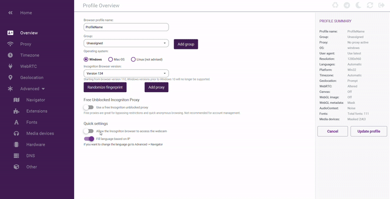
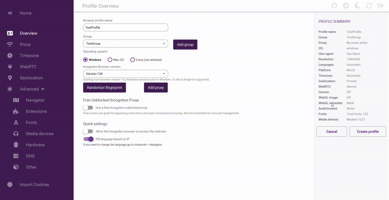

# Profile Setup

## Overview

Incogniton’s anti-detect browser lets you create profiles to manage your online identities securely. This guide gives you step-by-step instructions to set up a new profile that fits your needs. Make sure you’re logged in and have opened the **Profiles** tab from the main menu.

## Before Creating Your Profile

Before diving in, ensure you have a clear idea of the profile’s purpose. Whether it's for managing multiple social media accounts, testing web applications, or any other activity, having a descriptive profile name and understanding the necessary settings will help you stay organized.

### Step 1: Navigate to Profiles

- Click on the **Profiles** tab from the left menu.

#### Accessing your Profiles tab provides a centralized location to manage all your online identities, streamlining your workflow.

### Step 2: Create a New Profile/

- From the Profiles tab, click on the **New Profile** button.

#### Creating a new profile isolates your browsing activities, ensuring each digital identity is secure and organized.

### Step 3: Enter a profile name

- Enter a name for your profile

#### Choose a clear, descriptive name so you can easily recognize and differentiate this profile among others.

### Step 4: Set Operating System

- **Windows User:** Choose the **Windows** option.
- **Mac user:** Choose the **Mac OS** option.
- **Linux User:** Choose the **Linux** option (Note: Linux is not the recommended option).

#### Selecting your operating system ensures your profile is optimized for your device, minimizing compatibility issues.

### Step 5: Set Incognition verison

- Click the drop-down menu. It should show the latest version by default.
- If a newer version is available, select it.

#### Choosing the latest Incogniton version guarantees you benefit from up-to-date security features and performance improvements.

### Step 6: Randomize your Footprints

- Click **Randomize Footprint** to change browser details.
- This makes your digital fingerprint unique and harder to track.

#### Randomizing your browser fingerprint enhances privacy by making it more difficult for trackers to identify your browsing habits.

### Step 7: Create and Select Group

- Click **Add Group** and enter a group name. 
- Choose the group you just created from the drop-down menu. Grouping keeps your profiles organized.
  
#### Organizing your profiles into logical groups simplifies managing multiple profiles, especially when using different proxies

### Step 8: Extra Settings

- The settings for **Free Unblocked Proxy**, **Allow Camera**, and **Fill Language** are set by default.
- Leave these as they are unless you need to change them.
  
#### Reviewing extra settings helps ensure that default configurations match your specific needs, reducing the risk of misconfiguration.

### Step 9: Review and Save

- Check all your settings.
- Click **Create Profile** in the profile summary tab to finish setting up your profile.

#### A final review of your settings before saving ensures your profile is correctly configured and secure.
