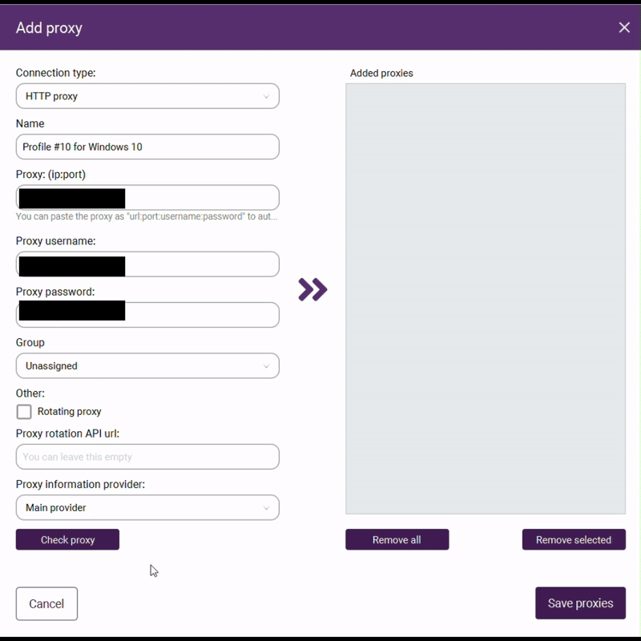

# Proxy Management

## Overview

Incogniton's anti-detect browser offers powerful proxy management capabilities that can be challenging to navigate for new users. This guide walks you through the optimal configuration and organization of your proxies to create a seamless setup that remains clear and manageable as your proxy and profile usage grows. For this tutorial, make sure you have navigated over to the "Proxy Management" tab on the left hand side of the home screen.

## Before Setting up your Proxies
Creating a group for your proxies

From inside the Proxy Management tab,
Click on the "Groups" option in the left sidebar →
Click the "New Group" button in the top right corner of the screen →
Give your group a descriptive name that reflects its purpose (e.g., "US Location" "Facebook Accounts" "Windows OS").
Organizing your proxies into logical groups makes managing multiple profiles with different proxies much easier.  

## Setting up Proxies
Confirm you're on the "Proxy Management" tab after creating your proxy groups, and then click near the top right corner "New Proxy"

### 1. Configure the Connection Type

Select the correct connection type that matches what your provider has supplied to ensure proper functionality. Your proxy provider will have specified whether you have an HTTP, SOCKS4, or SOCKS5 proxy. 

### 2. Naming Your Proxy

Type a clear naming convention for your proxy to make it easier for you to distinguish between multiple proxies when your collection grows. While you can use any naming system, we recommend including key identifying information such as: location, associated profile, and/or operating system.

### 3. Enter the Proxy IP Address

Copy and paste the IP address provided by your proxy service, followed by a colon (:) at the end. For example: "123.45.67.89:".

### 4. Add the Port Number
    
After entering your proxy IP address with the colon, add the port number directly after it without any spaces. Your completed entry should look like "123.45.67.89:8080" where 8080 is the port number provided by your proxy service.

### 5. Enter Your Proxy Username

Enter the username provided by your proxy service in the designated username field.

### 6. Enter Your Proxy Password

Enter the password provided by your proxy service provider in the designated password field.

### 7. Grouping your proxy
    
Assign your new proxy to a designated group. Placing each proxy in the appropriate category ensures efficient organization as your collection grows.

### 8. Configure Rotating Proxies (If Applicable)

If you have purchased a rotating proxy that automatically changes locations: Check the "Rotating Proxy" box in the configuration panel.
If your proxy provider has supplied a "Proxy Rotation API URL," paste it into the designated field (optional).

### 9. Verify Your Proxy Configuration
 
Click the "Check Proxy" button to run a connection test. The results will appear on the right side of the button showing your proxy's connection status. This is to verify that your proxy is functioning correctly. If the connection test fails, double-check your IP address, port number, username, and password entries for accuracy.
 

### 10. Save the Proxy Configuration

Click the two purple arrows (>>) in the center of the screen, then select "Save proxy."

## Conclusion

Properly configured and organized proxies are essential for maintaining a proper and seemless expierence in Incogniton. By following this guide and consistently applying good naming conventions and grouping strategies, you'll save significant time and avoid confusion as your proxy collection grows. Your organized proxy management system will allow you to quickly identify and select the right proxy for each profile, ensuring seamless operations across all your digital activities. As you become more comfortable with the platform, you may develop additional organizational methods tailored to your specific needs, but the foundation established here will serve you well as you scale your usage.