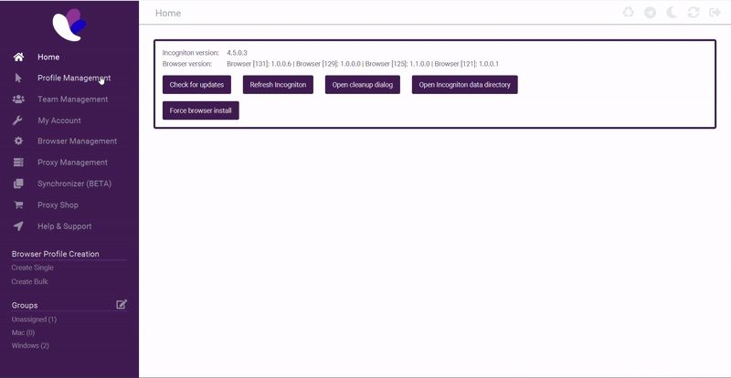
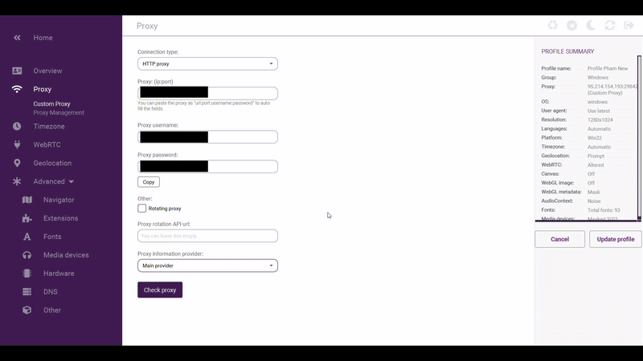
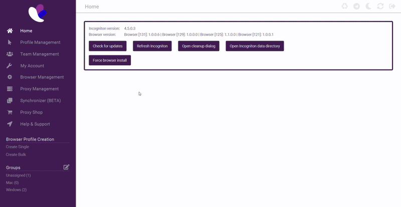
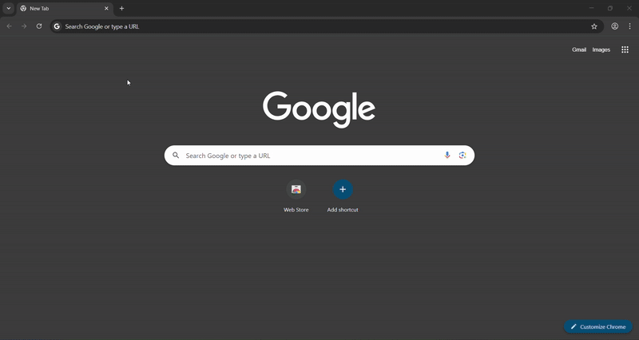
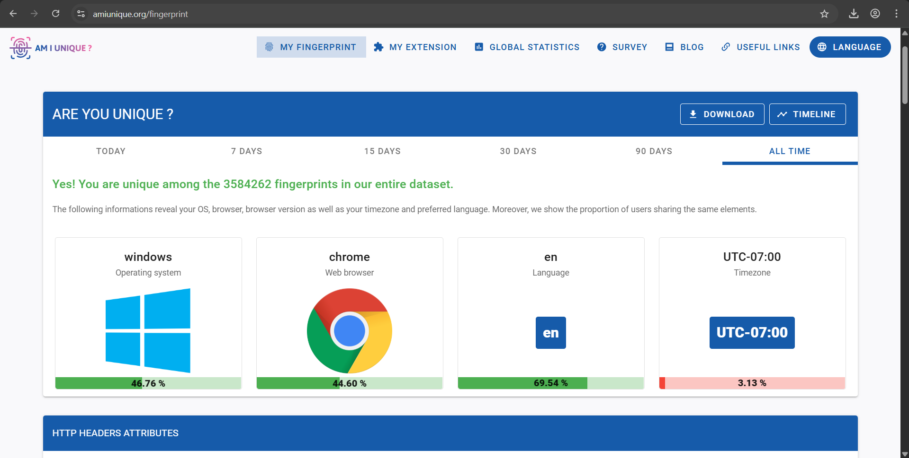
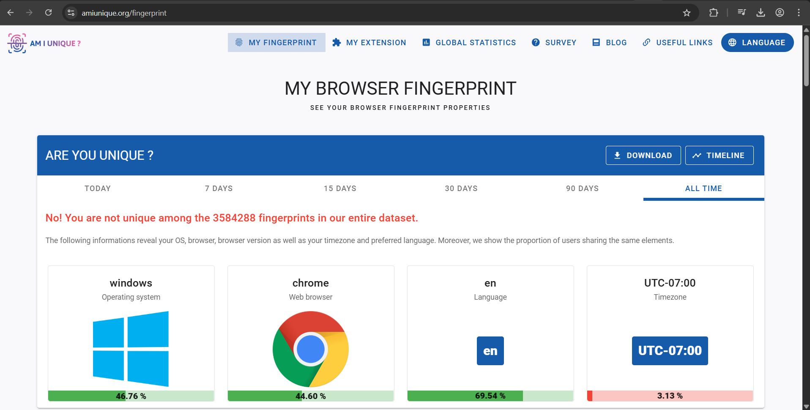

# Testing Profile FingerPrint

## Overview

This section will guide you through testing your Incogniton profile setup to ensure your online anonymity. We'll verify through 3 tests that your proxies are correctly configured through Incognitons profile settings, confirm your location appears as intended on Google Maps, and validate that your browser fingerprint remains unique across web fingerprint tests. These verification steps are crucial to maintaining separate, undetectable digital fingerprints across multiple accounts and ensuring websites cannot link your various profiles and local computer together.

## Testing proxy location from inside Incogniton

1. Navigate over to "Profile Management", find the profile you want to test your proxy location on -> click the three dots on the right (⋮) -> from that dropdown click the top choice "Edit". From there, click "Proxy" on the left side bar to access the proxy settings for this profile.

    

2. 
Press the purple box near the bottom of the screen called "Check Proxy". It will list out all of the information about where the proxy is located. 

#### Make sure that it's the location you intended on purchasing. This verification step ensures your proxy is correctly representing your desired location.

  - (Optional)
  If the location isn't correct, look above the purple "Check Proxy" button for a section called "Proxy information provider". Incogniton uses third-party providers to check proxy locations, and sometimes they incorrectly identify your location. Try selecting the backup provider, and if needed, the second back-up provider. 

    

#### If all three providers fail to identify the correct location of your proxy, you must contact your proxy provider as it's most likely an issue with the proxy itself.

## The next 2 Tests will by conducted by running a profile of your test choice.
From "Profile Management", click "Start" on the right hand side from the profile you want to test.
    

## Testing your browser location on Google Maps
#### This will reveal where Google Maps detects your browser's location, allowing you to verify your browser paired with your proxy is working correctly.

1. Type "googlemaps.com" into the search bar of the browser and visit the site. Click the target icon labeled "Show your Location" in the   bottom right corner of the screen. 
    

#### If your location is in the area you expect it to be, it is working! Otherwise, repeat "Testing proxy location" from inside Incogniton.

## Testing your fingerprint on Am I unique

 1. Type "amiunique.org" into the search bar of the browser and visit the site. Click the first button toward the lower left of the screen called "SEE MY FINGERPRINT" and wait roughly 15 seconds for the results to load.
    

 2. Repeat this step with another profile or outside of Incogniton on your regular browser. 

    #### Success Indicator
    #### The goal is for you to be unique among their database on each test you repeat. You should see a message in green text stating "Yes! You are unique among the 3500000 fingerprints in our entire dataset." This confirms your fingerprint isn't matched with any other fingerprint in your system, proving your anti-detection profile is working correctly.

    

    #### Fail Indicator
    #### A failed test will look something like "No! You are not unique among the 3500000 fingerprints in our entire dataset." This indicates you have been identfied somewhere else.

    

## Conclusion

By thoroughly testing your proxy configuration and browser fingerprint through the steps above, you've ensured your Incogniton profiles are properly set up for maximum anonymity. Checking proxy settings, confirming location accuracy in Google Maps, and validating uniqueness on AmIUnique provide confidence that your digital identities remain separate and undetectable across the internet. Testing these methods with all your profiles will help maintain the integrity of your profiles as you navigate online and protecting you from cross-profile tracking and identification. 

