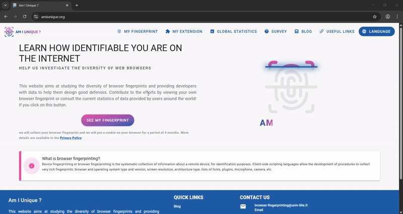

# Testing Profile FingerPrint

## Overview

This section will guide you through testing your Incogniton profile setup to ensure your online anonymity. We'll verify through 3 tests that your proxies are correctly configured through Incognitons profile settings, confirm your location appears as intended on Google Maps, and validate that your browser fingerprint remains unique across web fingerprint tests. These verification steps are crucial to maintaining separate, undetectable digital fingerprints across multiple accounts and ensuring websites cannot link your various profiles and local computer together.

## Testing proxy location from inside Incogniton

1. Navigate over to "Profile Management"

2. Choose the profile you want to test and click the three dots on the right (⋮) 

3. From the dropdown, click the top choice "Edit".

4. Click "Proxy" on the left side bar.

    

2. Click the purple box near the bottom of the screen called "Check Proxy". 

    **It will list out all of the information about where the proxy is located on the top right corner of the screen.**   
 
    

    !!! success "Success Indicator"
        If the proxy location matches your expected location, congratulations! Incogniton has correctly identified your proxy location.

        

    !!! danger "Fail Indicator"
        If the proxy location doesn't match your expected location, refer to the selection below **Failed proxy location**. If that doesn't work, contact your proxy provider

        

## Failed proxy location

If the proxy location isn't correct from **Testing proxy location from inside Incogniton**, 

1. Hover over the "Main provider" dropdown and switch providers.

2. Click the purple box near the bottom of the screen called "Check Proxy".

3. Repeat steps 1 and 2 until the correct location appears.
   
    **Incogniton uses third-party providers to check proxy locations, and sometimes, they incorrectly identify your location.**

    

## Testing your browser location on Google Maps

1. From "Profile Management", click "Start" on the right hand side of the profile you want to test.

    

2. Type "googlemaps.com" into the search bar of the browser and visit the site. 

    

3. Click the target icon labeled "Show your Location" in the bottom right corner of the screen. 

4. Click the middle dropdown option "Allow this time" near the top left of the screen.

    .gif)

    !!! success "Success Indicator"
        If your proxy location is in the area you expect it to be, you have verified your browser paired with your proxy is working correctly!

    !!! danger "Fail Indicator"
        If your proxy location isn't in the area you expected it to be, contact your proxy provider or try **Testing proxy location from inside Incogniton** if haven't haven't already.

## Testing your fingerprint on AmIunique

1. From "Profile Management", click "Start" on the right hand side of the profile you want to test.

    

 2. Type "amiunique.org" into the search bar of the browser and visit the site. 

    
 
 3. Click the first button toward the lower left of the screen called "SEE MY FINGERPRINT" and wait roughly up to 15 seconds for the results to load.

    

 4. Repeat step 3. with all your profiles. 

    

    !!! success "Success Indicator"
        The goal is for you to be unique among their database on each test you repeat. This confirms your fingerprint isn't matched with any other fingerprint in your system, proving your anti-detection profile is working correctly.

         

    !!! danger "Fail Indicator"
        A failed test indicates that your profile has been identified elsewhere, meaning it has been associated with another profile on your computer and has therefore been detected.

        

## Conclusion

By thoroughly testing your proxy configuration and browser fingerprint through the steps above, you've ensured your Incogniton profiles are properly set up for maximum anonymity. Checking proxy settings, confirming location accuracy in Google Maps, and validating uniqueness on AmIUnique provide confidence in the integrity of cross-profile tracking and identification. 

